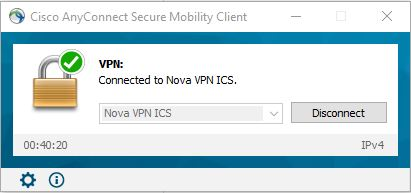
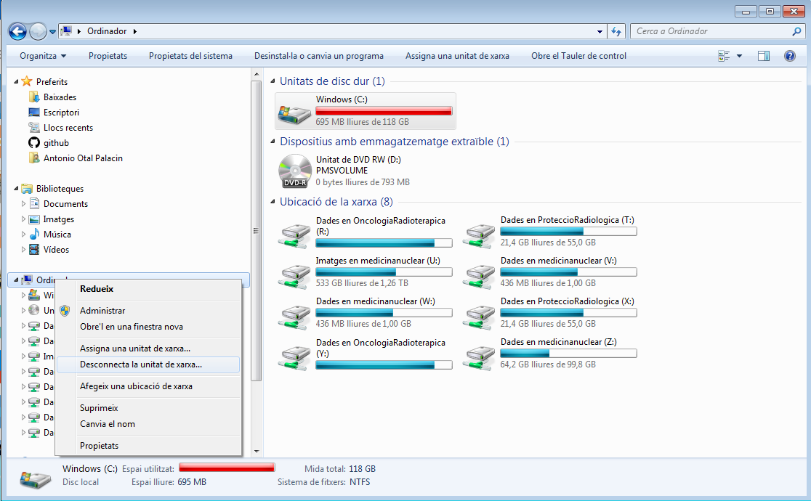
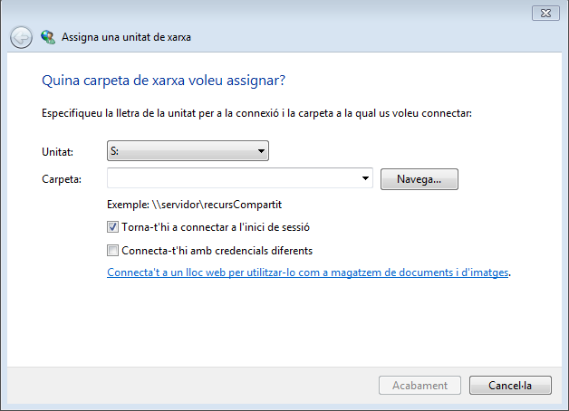
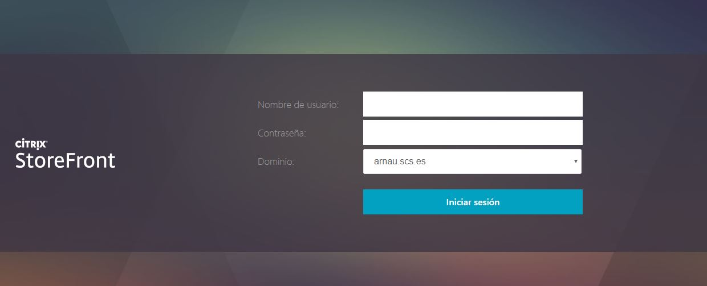
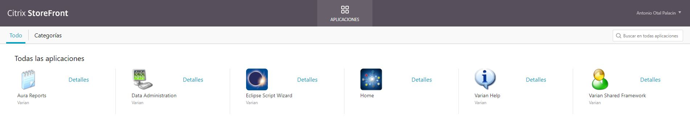
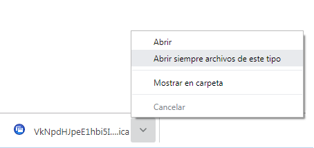
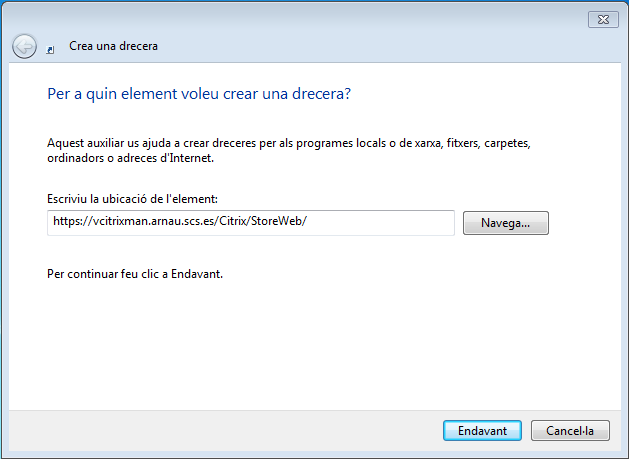

# Herramientas para el Teletrabajo HUAV

## Prerequisitos

- Tener la [VPN](https://software.cisco.com/download/navigator.html?mdfid=283000185&i=rm) del Arnau activada

## Configuración de unidades virtuales

En primer lugar abrimos una ventana de explorador de archivos y pulsamos botón derecho encima de MiPC (En la figura **Ordinador**) y vamos a **asignar unidad de red**.

Nos saldrá un menu donde elegiremos la letra de asignación a la unidad y la dirección. La letra será una que esté libre, normalmente nos ofrecerá una de las últimas y la dirección la siguiente:

- Para Oncología Radioterápica: **\\\Obelix.arnau.scs.es\E\OncologiaRadioterapica**
- Para Protección Radiológica: **\\\Obelix.arnau.scs.es\E\ProteccioRadiologica**

Cuando nos pida las credenciales, deberemos poner como usuario **dni@arnau.scs.es** y como password el nuestro de Windows del Hospital.

## Procedimiento para instalación de Citrix

En primer lugar, instalar la versión moderna del Citrix Receiver que se puede descargar [aquí](https://www.citrix.com/es-es/downloads/workspace-app/). Como hay problemas para descargarlo, el ejecutable está en la ruta SPRiR/Admin/TELETREBALL. Se llama Citrix Workspace App. Una vez hecho esto, nos conectamos a la dirección desde [Chrome](https://vcitrixman.arnau.scs.es/Citrix/StoreWeb/). Hay que pasar de instalar nada, ya que ya lo tenemos instalado todo, aceptar todo e indicarle que ya tenemos instalado el programa.

)

Nos logeamos con nuestro usuario de Windows del curro e iniciamos sesión. Saldrá una pantalla donde nos dice que si queremos instalar el Citrix receiver. Le decimos que ya lo tenemos y posteriormente nos saldrá una pantalla así:

Pinchamos en Home y nos dirá que descarga un fichero de nombre raro y extensión **.ica**. Lo descargamos, y hacemos doble click para ejecutarlo. Nos lo abrirá con el Citrix Workspace y en principio solamente tenemos que seguir instrucciones. Si queremos que en posteriores accesos nos ejecute directamente este fichero sin descargarlo pulsaremos en la flechita que queda a la derecha del fichero descargado y seleccionaremos **Abrir siempre archivos de este tipo**.

En caso de querer crear un acceso directo en el escritorio, nos ponemos en el mismo y con el botón derecho seleccionamos **$Crea\rightarrow Drecera$** y ponemos la URL con la que accedimos al StoreFront.

En la ruta .\SPRiR\Admin\TELETREBALL\ConexionCitrix\img se encuenta el fichero **logo.ico** por si alguien le quiere poner el icono al acceso directo.
